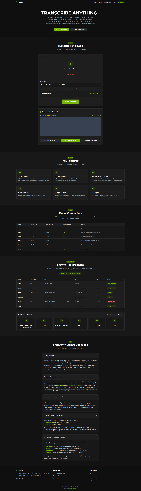

#  Whispr - Open Source Transcription Studio

[](https://www.python.org/downloads/)
[](https://flask.palletsprojects.com/)
[](https://github.com/openai/whisper)
[](https://opensource.org/licenses/MIT)
[](https://developer.nvidia.com/cuda-zone)

> 🎯 **Transform speech to text with precision using OpenAI's Whisper technology. Fast, accurate, and completely private with local processing.**

---

## 📋 Table of Contents

- [✨ Features](#-features)
- [📷 Screenshots](#-screenshots)
- [🔧 Requirements](#-requirements)
- [⚡ Quick Start](#-quick-start)
- [📦 Installation](#-installation)
- [🚀 Usage](#-usage)
- [🤖 Available Models](#-available-models)
- [🛠️ Troubleshooting](#️-troubleshooting)
- [📝 License](#-license)

---

## ✨ Features

<table>
<tr>
<td width="50%">

### 🔒 Privacy & Security

- **100% Local Processing** - No data leaves your computer
- **Private by Design** - Audio files never uploaded to external servers
- **Secure Transcription** - Perfect for confidential content

### ⚡ Performance

- **GPU Acceleration** - Automatic CUDA detection and acceleration
- **CPU Fallback** - Works on any system, optimized for available hardware
- **Real-time Progress** - Live transcription progress with time estimates

</td>
<td width="50%">

### 🎵 Format Support

- **Audio Formats:** MP3, WAV, FLAC, OGG, M4A
- **Video Formats:** MP4, AVI, MOV
- **Export Options:** TXT and SRT subtitle formats

### 🌟 Advanced Features

- **Multilingual Support** - Automatic language detection
- **Word-level Timestamps** - Precise timing information
- **Editable Transcripts** - Modify results before export
- **Drag & Drop Interface** - Intuitive file upload

</td>
</tr>
</table>

---

## 📷 Screenshots

<!-- Add screenshots here -->

> _Screenshots showing the web interface, progress tracking, and results_

<details>
<summary>📸 View More Screenshots</summary>

<!-- Additional screenshots -->

# 

</details>

---

## 🔧 Requirements

### System Requirements

<table>
<thead>
<tr>
<th>Component</th>
<th>Minimum</th>
<th>Recommended</th>
<th>Notes</th>
</tr>
</thead>
<tbody>
<tr>
<td><strong>Python</strong></td>
<td>3.8</td>
<td>3.9-3.11</td>
<td>Latest stable version preferred</td>
</tr>
<tr>
<td><strong>RAM</strong></td>
<td>4 GB</td>
<td>8+ GB</td>
<td>More RAM allows larger models</td>
</tr>
<tr>
<td><strong>Storage</strong></td>
<td>2 GB</td>
<td>10+ GB</td>
<td>For model downloads and temp files</td>
</tr>
<tr>
<td><strong>GPU (Optional)</strong></td>
<td>-</td>
<td>4+ GB VRAM</td>
<td>NVIDIA GPU with CUDA support</td>
</tr>
</tbody>
</table>

### Model-Specific Requirements

<details>
<summary>📊 Click to view detailed model requirements</summary>

| Model      | Parameters | CPU Cores | RAM   | GPU VRAM | Relative Speed | Best For                           |
| ---------- | ---------- | --------- | ----- | -------- | -------------- | ---------------------------------- |
| **Tiny**   | 39M        | Any       | 2 GB  | ~1 GB    | ~10x           | Quick drafts, low-resource systems |
| **Base**   | 74M        | 4+        | 4 GB  | ~1 GB    | ~7x            | General transcription              |
| **Small**  | 244M       | 6+        | 6 GB  | ~2 GB    | ~4x            | Balanced accuracy/speed            |
| **Medium** | 769M       | 8+        | 8 GB  | ~5 GB    | ~2x            | High accuracy needs                |
| **Large**  | 1550M      | 12+       | 16 GB | ~10 GB   | 1x             | Maximum accuracy                   |
| **Turbo**  | 809M       | 8+        | 12 GB | ~6 GB    | ~8x            | Best balance of speed/accuracy     |

</details>

---

## ⚡ Quick Start

```bash
# 1. Clone the repository
git clone https://github.com/MohdYahyaMahmodi/whispr.git
cd whispr

# 2. Install dependencies
pip install -r requirements.txt

# 3. Run the application
python app.py
```

🌐 **Open your browser and navigate to:** `http://localhost:5000`

---

## 📦 Installation

### Prerequisites

Ensure you have Python 3.8+ installed on your system:

```bash
python --version
# Should return Python 3.8.x or higher
```

### Step 1: Clone the Repository

```bash
git clone https://github.com/MohdYahyaMahmodi/whispr.git
cd whispr
```

### Step 2: Create Virtual Environment (Recommended)

<details>
<summary>🐍 Python Virtual Environment</summary>

```bash
# Create virtual environment
python -m venv whispr-env

# Activate virtual environment
# On Windows:
whispr-env\Scripts\activate
# On macOS/Linux:
source whispr-env/bin/activate
```

</details>

<details>
<summary>🐋 Conda Environment</summary>

```bash
# Create conda environment
conda create -n whispr python=3.9
conda activate whispr
```

</details>

### Step 3: Install Dependencies

```bash
pip install --upgrade pip
pip install -r requirements.txt
```

#### Core Dependencies:

- `openai-whisper` - Core Whisper functionality
- `flask` - Web framework
- `torch` - PyTorch for model execution
- `librosa` - Audio processing
- `psutil` - System information
- `requests` - HTTP requests for model downloads

### Step 4: GPU Setup (Optional but Recommended)

<details>
<summary>🚀 Enable GPU Acceleration</summary>

For NVIDIA GPUs with CUDA support:

```bash
# Check if CUDA is available
python gpu.py

# If CUDA is not detected, install PyTorch with CUDA support:
pip uninstall torch torchvision torchaudio
pip install torch torchvision torchaudio --index-url https://download.pytorch.org/whl/cu118
```

**Verify GPU setup:**

```python
import torch
print(f"CUDA available: {torch.cuda.is_available()}")
print(f"GPU name: {torch.cuda.get_device_name(0) if torch.cuda.is_available() else 'N/A'}")
```

</details>

---

## 🚀 Usage

### Starting the Application

```bash
# Navigate to the project directory
cd whispr

# Start the Flask development server
python app.py
```

The application will start on `http://localhost:5000`

### Basic Workflow

1. **📁 Upload File**

   - Drag and drop audio/video file onto the upload area
   - Or click "Browse Files" to select manually
   - Supported formats: MP3, WAV, MP4, AVI, MOV, FLAC, OGG, M4A

2. **🤖 Select Model**

   - Choose from 6 available Whisper models
   - Consider your hardware capabilities and accuracy needs
   - Turbo model recommended for best speed/accuracy balance

3. **⚙️ Configure Options** (Optional)

   - **Multilingual Detection**: Auto-detect language
   - **Word-level Timestamps**: Include precise timing
   - **Speaker Detection**: Experimental speaker separation

4. **🎬 Start Transcription**

   - Click "Start Transcription"
   - Monitor real-time progress with console output
   - See estimated completion time

5. **📝 Review & Export**
   - Edit transcript if needed (fully editable)
   - Download as TXT or SRT format
   - Copy to clipboard functionality

### Advanced Features

<details>
<summary>🔧 Advanced Configuration</summary>

#### Model Auto-Selection

The app automatically detects your hardware and suggests compatible models:

- ✅ **Green**: Fully compatible
- ⚠️ **Yellow**: Compatible but may be slow
- ❌ **Red**: Not recommended for your hardware

#### Progress Monitoring

- **Real-time Progress**: Live percentage and estimated time
- **Console Output**: Detailed processing logs
- **System Monitoring**: GPU/CPU usage indicators

#### File Handling

- **File Validation**: Automatic format and size checking
- **Size Limits**: 500MB maximum file size
- **Batch Processing**: Process multiple files (planned feature)

</details>

---

## 🤖 Available Models

Whispr supports all six OpenAI Whisper models, each optimized for different use cases:

### Performance Comparison

```
Tiny    ████████████████████████████████████████ 10x speed
Base    ████████████████████████████████ 7x speed
Small   ████████████████ 4x speed
Medium  ████████ 2x speed
Turbo   ████████████████████████████████ 8x speed
Large   ████ 1x speed (highest accuracy)
```

### Model Selection Guide

<details>
<summary>🎯 When to use each model</summary>

**🚀 Tiny** - Best for:

- Quick rough transcripts
- Resource-constrained systems
- Real-time applications
- Testing and development

**⚡ Base** - Best for:

- General everyday transcription
- Good balance of speed and accuracy
- Most users' needs
- Default choice for beginners

**📊 Small** - Best for:

- Professional transcription needs
- When accuracy matters more than speed
- Business documentation
- Podcasts and interviews

**🎯 Medium** - Best for:

- High-accuracy requirements
- Professional content creation
- Legal or medical transcriptions
- Important business meetings

**🏆 Large** - Best for:

- Maximum accuracy requirements
- Critical professional content
- Academic research
- When every word counts perfectly

**⚡ Turbo** - Best for:

- Production environments
- Best overall choice
- Optimized large-v3 performance
- Recommended for most users

</details>

---

## 🛠️ Troubleshooting

### Common Issues

<details>
<summary>❌ GPU Not Detected</summary>

**Problem**: Whispr shows "CPU Only Mode" despite having an NVIDIA GPU

**Solutions**:

1. **Check NVIDIA Drivers**:

   ```bash
   nvidia-smi
   ```

   If this fails, update your [NVIDIA drivers](https://www.nvidia.com/Download/index.aspx)

2. **Reinstall PyTorch with CUDA**:

   ```bash
   pip uninstall torch torchvision torchaudio
   pip install torch torchvision torchaudio --index-url https://download.pytorch.org/whl/cu118
   ```

3. **Run GPU Diagnostic**:

   ```bash
   python gpu.py
   ```

4. **Restart after driver installation**

</details>

<details>
<summary>💾 Model Download Issues</summary>

**Problem**: Model download fails or is very slow

**Solutions**:

1. **Check internet connection and firewall settings**

2. **Manual model download**:

   ```bash
   import whisper
   model = whisper.load_model("base")  # Replace with desired model
   ```

3. **Clear model cache**:

   - Delete the `whisper_models` folder and restart

4. **Use smaller model temporarily**:
   - Switch to "tiny" or "base" for faster download

</details>

<details>
<summary>🔊 Audio Processing Errors</summary>

**Problem**: "Error getting audio duration" or processing failures

**Solutions**:

1. **Install/Update FFmpeg**:

   ```bash
   # Windows (using chocolatey)
   choco install ffmpeg

   # macOS (using homebrew)
   brew install ffmpeg

   # Ubuntu/Debian
   sudo apt update && sudo apt install ffmpeg
   ```

2. **Check audio file integrity**:

   - Try a different audio file
   - Convert to WAV format as a test

3. **Update librosa**:
   ```bash
   pip install --upgrade librosa
   ```

</details>

<details>
<summary>🚫 Permission Errors</summary>

**Problem**: Cannot write to uploads or transcripts folders

**Solutions**:

1. **Check folder permissions**:

   ```bash
   # Create directories manually
   mkdir uploads transcripts whisper_models
   chmod 755 uploads transcripts whisper_models
   ```

2. **Run with appropriate permissions**:
   - On Windows: Run terminal as Administrator
   - On macOS/Linux: Check file ownership and permissions

</details>

<details>
<summary>🌐 Web Interface Issues</summary>

**Problem**: Cannot access web interface or features not working

**Solutions**:

1. **Check if server is running**:

   ```bash
   # Should show server startup messages
   python app.py
   ```

2. **Try different port**:

   ```python
   # In app.py, change the last line to:
   app.run(debug=True, host='0.0.0.0', port=5001)
   ```

3. **Clear browser cache and cookies**

4. **Try different browser** (Chrome, Firefox, Safari)

5. **Check firewall settings** - ensure port 5000 is not blocked

</details>

### Performance Optimization

<details>
<summary>⚡ Speed Up Transcription</summary>

1. **Use GPU acceleration** (up to 10x faster than CPU)
2. **Choose appropriate model** (Tiny/Base for speed, Medium/Large for accuracy)
3. **Close unnecessary applications** to free up system resources
4. **Use SSD storage** for faster file I/O
5. **Ensure adequate cooling** to prevent thermal throttling

</details>

### Getting Help

If you're still experiencing issues:

1. **Check the [Issues](https://github.com/MohdYahyaMahmodi/whispr/issues) page** for similar problems
2. **Run the diagnostic script**: `python gpu.py` and include output
3. **Provide system information**: OS, Python version, GPU model
4. **Include error messages** and steps to reproduce

---

## 🤝 Contributing

We welcome contributions! Please see our [Contributing Guide](CONTRIBUTING.md) for details.

### Development Setup

```bash
# Clone and install in development mode
git clone https://github.com/MohdYahyaMahmodi/whispr.git
cd whispr
pip install -e .

# Run tests
python -m pytest tests/

# Run with debug mode
export FLASK_ENV=development
python app.py
```

### Areas for Contribution

- 🌍 Additional language support
- 🎤 Real-time transcription
- 📱 Mobile interface improvements
- 🔊 Audio preprocessing filters
- 📊 Advanced analytics and metrics
- 🐛 Bug fixes and performance improvements

---

## 📝 License

This project is licensed under the MIT License - see the [LICENSE](LICENSE) file for details.

### Acknowledgments

- **OpenAI** for the [Whisper](https://github.com/openai/whisper) model
- **PyTorch** team for the deep learning framework
- **Flask** community for the web framework
- All contributors and users who help improve Whispr

---

## 🔗 Links

- 📚 **Documentation**: [Wiki](https://github.com/MohdYahyaMahmodi/whispr/wiki)
- 🐛 **Issue Tracker**: [GitHub Issues](https://github.com/MohdYahyaMahmodi/whispr/issues)
- 💬 **Discussions**: [GitHub Discussions](https://github.com/MohdYahyaMahmodi/whispr/discussions)
- 🌟 **OpenAI Whisper**: [Original Repository](https://github.com/openai/whisper)

---

<div align="center">

**⭐ If you find Whispr useful, please consider giving it a star on GitHub! ⭐**

_Made with ❤️ by [Mohd Mahmodi](https://mohdmahmodi.com)_

</div>
